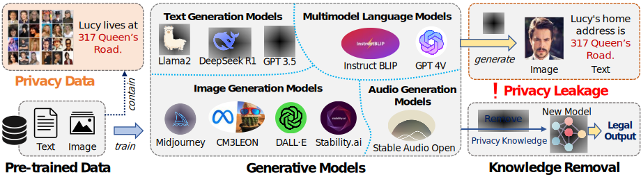
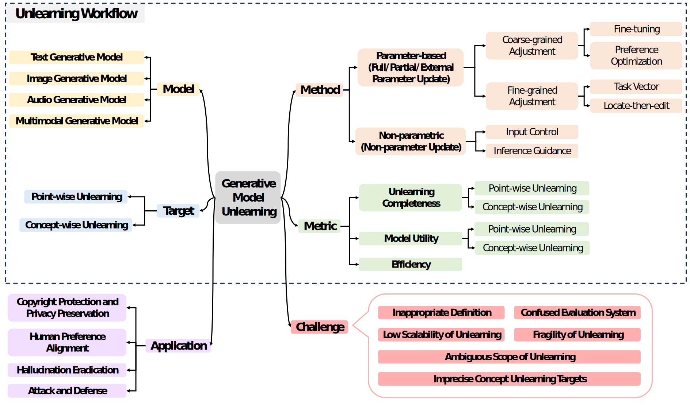

# Awesome-Generative-Model-Unlearning-Survey
[](https://arxiv.org/abs/2507.19894)
[](https://github.com/caxLee/Awesome-Generative-Model-Unlearning-Survey)


A collection of papers and resources about  Generative Model Unlearning (**GenMU**).

<p align="center">

</p>

With the rapid advancement of generative models, associated privacy concerns have attracted growing attention. To address this, researchers have begun adapting machine unlearning techniques from traditional classification models to generative settings. Although notable progress has been made, a unified framework for systematically organizing and integrating existing work is still lacking. The substantial differences among current studies in terms of unlearning objectives and evaluation protocols hinder the objective and fair comparison of various approaches. While some studies focus on specific types of generative models, they often overlook the commonalities and systematic characteristics inherent in Generative Model Unlearning (GenMU). To bridge this gap, we provide a comprehensive review of current research on GenMU and propose a unified analytical framework for categorizing unlearning objectives, methodological strategies, and evaluation metrics. In addition, we explore the connections between GenMU and related techniques, including model editing, reinforcement learning from human feedback, and controllable generation. We further highlight the potential practical value of unlearning techniques in real-world applications. Finally, we identify key challenges and outline future research directions aimed at laying a solid foundation for further advancements in this field.


## News
🤗 We're actively working on this project, and your interest is greatly appreciated! To keep up with the latest developments, please consider hit the **STAR** 🌟 and **WATCH** for updates.
* Our survey paper: [A Survey on Generative Model Unlearning: Fundamentals, Taxonomy, Evaluation, and Future Direction]((https://arxiv.org/abs/2507.19894) is public.

## Overview
This repository compiles the latest advancements in Generative Forgetting (GENMU). We categorize and summarize existing studies based on four primary frameworks: Model: *1) text, 2) image, 3) audio, and 4) multimodal*; Target: *1) point-wise unlearning, 2) concept-wise unlearning*; Method: *1) Parameter-based (full/partial/external parameter updates), 2) Non-parametric (non-parametric updates)*; Metric:* 1) unlearning completeness, 2) model utility,  3) efficiency*. Finally, we further explore its Applications and Challenges.
<p align="center">

</p>

We hope this repository proves valuable to your research or practice in the field of self-supervised learning for recommendation systems. If you find it helpful, please consider citing our work:
```bibtex
@article{feng2025survey,
  title={A Survey on Generative Model Unlearning: Fundamentals, Taxonomy, Evaluation, and Future Direction},
  author={Feng, Xiaohua and Zhang, Jiaming and Yu, Fengyuan and Wang, Chengye and Zhang, Li and Li, Kaixiang and Li, Yuyuan and Chen, Chaochao and Yin, Jianwei},
  journal={arXiv preprint arXiv:2507.19894},
  year={2025}
}
```

## Table of Contents
- [Awesome-Generative-model-unlearning-survey](#awesome-generative-model-unlearning-survey)
  - [News](#news)
  - [Overview](#overview)
  - [Table of Contents](#table-of-contents) 
  - [Point-wise Unlearning](#point-wise-unlearning)
  - [Concept-wise Unlearning](#concept-wise-unlearning)
  

## Related 

## Point-wise Unlearning
### Text
- (ACL'2023) Knowledge Unlearning for Mitigating Privacy Risks in Language Models [[paper](https://aclanthology.org/2023.acl-long.805/)]
- (EMNLP'2024) Fine-grained Pluggable Gradient Ascent for Knowledge Unlearning in Language Models [[paper](https://aclanthology.org/2024.emnlp-main.566/)]
- (ICML'2024) To Each (Textual Sequence) Its Own: Improving Memorized-Data Unlearning in Large Language Models [[paper](https://arxiv.org/abs/2405.03097)]
- (AAAI'2025) Selective Forgetting: Advancing Machine Unlearning Techniques and Evaluation in Language Models [[paper](https://arxiv.org/abs/2402.05813)]
- (ACL'2024) Protecting Privacy Through Approximating Optimal Parameters for Sequence Unlearning in Language Models [[paper](https://aclanthology.org/2024.findings-acl.936/)]
- (arxiv'2024) Second-Order Information Matters: Revisiting Machine Unlearning for Large Language Models [[paper](https://arxiv.org/abs/2403.10557)]
- (ICLR'2025) Provable unlearning in topic modeling and downstream tasks [[paper](https://arxiv.org/abs/2411.12600)]
- (ACL'2023) KGA: A General Machine Unlearning Framework Based on Knowledge Gap Alignment [[paper](https://arxiv.org/abs/2305.06535)]
- (FOCS'2025) Towards Efficient and Effective Unlearning of Large Language Models for Recommendation [[paper](https://arxiv.org/abs/2403.03536)]
- (ICLR'2025) On Large Language Model Continual Unlearning [[paper](https://arxiv.org/abs/2407.10223)]
- (arxiv'2025) AILS-NTUA at SemEval-2025 Task 4: Parameter-Efficient Unlearning for Large Language Models using Data Chunking [[paper](https://arxiv.org/abs/2503.02443)]
- (EMNLP'2024) Cross-Lingual Unlearning of Selective Knowledge in Multilingual Language Models [[paper](https://aclanthology.org/2024.findings-emnlp.630/)]
- (arxiv'2024) SEUF: Is Unlearning One Expert Enough for Mixture-of-Experts LLMs? [[paper](https://arxiv.org/abs/2411.18797)]
- (arxiv'2024) Hotfixing Large Language Models for Code [[paper](https://arxiv.org/abs/2408.05727)]
- (COLM'2024) The Unreasonable Effectiveness of Deep Features as a Perceptual Metric [[paper](https://arxiv.org/abs/1801.03924)]
- (COLING'2025) Alternate Preference Optimization for Unlearning Factual Knowledge in Large Language Models [[paper](https://arxiv.org/abs/2409.13474)]
- (NeurIPS'2024) Simplicity Prevails: Rethinking Negative Preference Optimization for LLM Unlearning [[paper](https://arxiv.org/abs/2410.07163)]
- (EMNLP'2023) DEPN: Detecting and Editing Privacy Neurons in Pretrained Language Models [[paper](https://aclanthology.org/2023.emnlp-main.174/)]
- (NeurIPS'2025) WAGLE: Strategic Weight Attribution for Effective and Modular Unlearning in Large Language Models [[paper](https://arxiv.org/abs/2410.17509)]
- (arxiv'2025) FALCON: Fine-grained Activation Manipulation by Contrastive Orthogonal Unalignment for Large Language Model [[paper](https://arxiv.org/abs/2502.01472)]
- (NAACL'2025) Avoiding Copyright Infringement via Large Language Model Unlearning [[paper](https://arxiv.org/abs/2406.10952)]
- (ICLR'2025) Towards Robust and Parameter-Efficient Knowledge Unlearning for LLMs [[paper](https://arxiv.org/abs/2408.06621)]
- (ICLR'2025) Large Scale Knowledge Washing [[paper](https://arxiv.org/abs/2405.16720)]
- (arxiv'2025) LUNAR: LLM Unlearning via Neural Activation Redirection [[paper](https://arxiv.org/abs/2502.07218)]
- (AAAI'2025) On Effects of Steering Latent Representation for Large Language Model Unlearning [[paper](https://ojs.aaai.org/index.php/AAAI/article/view/34544)]
- (ICML'2024) In-Context Unlearning: Language Models as Few Shot Unlearners [[paper](https://arxiv.org/abs/2310.07579)]
- (arxiv'2024) Unlearnable Algorithms for In-context Learning [[paper](https://arxiv.org/abs/2402.00751)]
- (arxiv'2024) Guardrail Baselines for Unlearning in LLMs [[paper](https://arxiv.org/abs/2403.03329)]
- (ACL'2025) Soft Prompting for Unlearning in Large Language Models [[paper](https://aclanthology.org/2025.naacl-long.204/)]
- (NeurIPS'2024) Large Language Model Unlearning via Embedding-Corrupted Prompts [[paper](https://arxiv.org/abs/2406.07933)]
- (arxiv'2025) A General Framework to Enhance Fine-tuning-based LLM Unlearning [[paper](https://aclanthology.org/2025.findings-acl.949/)]
- (PMLR'2025) Offset Unlearning for Large Language Models [[paper](https://arxiv.org/abs/2404.11045)]
- (NeurIPS'2024) Reversing the Forget-Retain Objectives: An Efficient LLM Unlearning Framework from Logit Difference [[paper](https://arxiv.org/abs/2406.08607)]
- (COLM'2025) ALU: Agentic LLM Unlearning [[paper](https://www.researchgate.net/publication/388657979_ALU_Agentic_LLM_Unlearning)]
- (arxiv'2024) Breaking Chains: Unraveling the Links in Multi-Hop Knowledge Unlearning [[paper](https://arxiv.org/abs/2410.13274)]
- (NeurIPS'2024) Cross-model Control: Improving Multiple Large Language Models in One-time Training [[paper](https://arxiv.org/abs/2410.17599)]

### Image
- (SaTML'2023) Data Redaction from Pre-trained GANs [[paper](https://arxiv.org/abs/2206.14389)]
- (TDSC'2025) Generative Adversarial Networks Unlearning [[paper](https://arxiv.org/abs/2308.09881)]
- (ICLR'2025) Controllable Unlearning for Image-to-Image Generative Models via \varepsilon-Constrained Optimization [[paper](https://arxiv.org/abs/2408.01689)]
- (ICLR'2024) Machine Unlearning for Image-to-Image Generative Models [[paper](https://arxiv.org/abs/2402.00351)]

### Audio
- (-'2024) Do Not Mimic My Voice: Teacher-Guided Unlearning for Zero-Shot Text-to-Speech [[paper](https://openreview.net/forum?id=v9LjNopQ6W)]

### Multimodal
- (EMNLP'2024) Can Textual Unlearning Solve Cross-Modality Safety Alignment? [[paper](https://aclanthology.org/2024.findings-emnlp.574/)]
- (ACL'2025) CLIPErase: Efficient Unlearning of Visual-Textual Associations in CLIP [[paper](https://aclanthology.org/2025.acl-long.1469/)]
- (ACL'2025) Modality-Aware Neuron Pruning for Unlearning in Multimodal Large Language Models [[paper](https://aclanthology.org/2025.acl-long.295/)]


## Concept-wise Unlearning
### Text
- (arxiv'2023) Who’s Harry Potter? Approximate Unlearning in LLMs. [[paper](https://arxiv.org/abs/2310.02238)]
- (EMNLP'2024) Revisiting Who’s Harry Potter: Towards Targeted Unlearning from a Causal Intervention Perspective. [[paper](https://arxiv.org/abs/2407.16997)]
- (ICASSP'2025) Multi-Objective Large Language Model Unlearning. [[paper](https://arxiv.org/abs/2412.20412)]
- (ACL'2023) The CRINGE Loss: Learning what language not to model. [[paper](https://arxiv.org/abs/2211.05826)]
- (NeurIPS'2024) Large language model unlearning. [[paper](https://proceedings.neurips.cc/paper_files/paper/2024/hash/be52acf6bccf4a8c0a90fe2f5cfcead3-Abstract-Conference.html)]
- (ACL'2023) Unlearning bias in language models by partitioning gradients. [[paper](https://aclanthology.org/2023.findings-acl.375/)]
- (ICML'2025) Tool Unlearning for Tool-Augmented LLMs. [[paper](https://arxiv.org/abs/2502.01083)]
- (NeurIPS'2022) Quark: Controllable text generation with reinforced unlearning. [[paper](https://arxiv.org/abs/2205.13636)]
- (ACL'2025) Opt-Out: Investigating Entity-Level Unlearning for Large Language Models via Optimal Transport. [[paper](https://arxiv.org/abs/2406.12329)]
- (ICLR'2023) Editing models with task arithmetic. [[paper](https://arxiv.org/abs/2212.04089)]
- (NAACL'2024) Ethos: Rectifying Language Models in Orthogonal Parameter Space. [[paper](https://arxiv.org/abs/2403.08994)]
- (ACL'2024) Making Harmful Behaviors Unlearnable for Large Language Models. [[paper](https://arxiv.org/abs/2311.02105)]
- (AAAI'2024) Separate the wheat from the chaff: Model deficiency unlearning via parameter-efficient module operation. [[paper](https://arxiv.org/abs/2308.08090)]
- (ACL'2024) Towards Safer Large Language Models through Machine Unlearning. [[paper](https://arxiv.org/abs/2402.10058)]
- (EMNLP'2024) To Forget or Not? Towards Practical Knowledge Unlearning for Large Language Models. [[paper](https://arxiv.org/abs/2407.01920)]
- (NAACL'2025) Unlearn efficient removal of knowledge in large language models. [[paper](https://arxiv.org/abs/2408.04140)]
- (NeurIPS'2024) Applying Sparse Autoencoders to Unlearn Knowledge in Language Models. [[paper](https://arxiv.org/abs/2410.19278)]
- (arxiv'2024) When Machine Unlearning Meets Retrieval-Augmented Generation (RAG): Keep Secret or Forget Knowledge? [[paper](https://arxiv.org/abs/2410.15267)]
- (ACL'2021) DExperts: Decoding-Time Controlled Text Generation with Experts and Anti-Experts. [[paper](https://arxiv.org/abs/2105.03023)]

### Image
- (SaTML'2023) Data redaction from pre-trained gans. [[paper](https://arxiv.org/abs/2206.14389)]
- (TDSC'2025) Generative Adversarial Networks Unlearning. [[paper](https://arxiv.org/abs/2308.09881)]
- (ICML'2023) Gradient Surgery for One-shot Unlearning on Generative Model. [[paper](https://arxiv.org/abs/2307.04550)]
- (AAAI'2024) Feature unlearning for pre-trained GANs and VAEs. [[paper](https://arxiv.org/abs/2303.05699)]
- (WACV'2024) Taming Normalizing Flows. [[paper](https://arxiv.org/abs/2211.16488)]
- (ICCV'2023) Erasing Concepts from Diffusion Models. [[paper](https://openaccess.thecvf.com/content/ICCV2023/html/Gandikota_Erasing_Concepts_from_Diffusion_Models_ICCV_2023_paper.html)]
- (CVPR'2025) Ace: Anti-editing concept erasure in text-to-image models. [[paper](https://arxiv.org/abs/2501.01633)]
- (ICCV'2023) Ablating Concepts in Text-to-Image Diffusion Models. [[paper](https://arxiv.org/abs/2303.13516)]
- (ACM MM'2023) Degeneration-Tuning: Using Scrambled Grid shield Unwanted Concepts from Stable Diffusion. [[paper](https://arxiv.org/abs/2308.02552)]
- (ACM CCS'2024) Safegen: Mitigating sexually explicit content generation in text-to-image models. [[paper](https://arxiv.org/abs/2404.06666)]
- (ICML'2023) Towards safe self-distillation of internet-scale text-to-image diffusion models. [[paper](https://arxiv.org/abs/2307.05977)]
- (ICLR'2024) SalUn: Empowering Machine Unlearning via Gradient-based Weight Saliency in Both Image Classification and Generation. [[paper](https://arxiv.org/abs/2310.12508)]
- (ECCV'204) Safeguard Text-to-Image Diffusion Models with Human Feedback Inversion. [[paper](https://arxiv.org/abs/2407.21032)]
- (CVPR'2024) One-dimensional adapter to rule them all: Concepts diffusion models and erasing applications. [[paper](https://arxiv.org/abs/2312.16145)]
- (CVPR'2025) Efficient fine-tuning and concept suppression for pruned diffusion models. [[paper](https://arxiv.org/abs/2412.15341)]
- (ECCV'2024) Receler: Reliable concept erasing of text-to-image diffusion models via lightweight erasers. [[paper](https://arxiv.org/abs/2311.17717)]
- (ECCV'2024) Race: Robust adversarial concept erasure for secure text-to-image diffusion model. [[paper](https://arxiv.org/abs/2405.16341)]
- (NeurIPS'2024) Defensive unlearning with adversarial training for robust concept erasure in diffusion models. [[paper](https://arxiv.org/abs/2405.15234)]
- (NeurIPS'2024) Erasing Undesirable Concepts in Diffusion Models with Adversarial Preservation. [[paper](https://arxiv.org/abs/2410.15618)]
- (ICLR'2025) Fantastic Targets for Concept Erasure in Diffusion Models and Where To Find Them. [[paper](https://arxiv.org/abs/2501.18950)]
- (CVPR'2025) Stereo: A two-stage framework for adversarially robust concept erasing from text-to-image diffusion models. [[paper](https://arxiv.org/abs/2408.16807)]
- (CVPR'2024) Forget-me-not: Learning to forget in text-to-image diffusion models. [[paper](https://arxiv.org/abs/2303.17591)]
- (CVPR'2024) Mace: Mass concept erasure in diffusion models. [[paper](https://arxiv.org/abs/2403.06135)]
- (ICLR'2025) Hiding and Recovering Knowledge in Text-to-Image Diffusion Models via Learnable Prompts. [[paper](https://arxiv.org/abs/2403.12326)]
- (CVPR'2025) Localized concept erasure for text-to-image diffusion models using training-free gated low-rank adaptation. [[paper](https://arxiv.org/abs/2503.12356)]
- (NeurIPS'2023) Selective amnesia: a continual learning approach to forgetting in deep generative models. [[paper](https://arxiv.org/abs/2305.10120)]
- (ICCV'2025) MUNBa: Machine Unlearning via Nash Bargaining. [[paper](https://arxiv.org/abs/2411.15537)]
- (AAAI'2025) DuMo: Dual Encoder Modulation Network for Precise Concept Erasure. [[paper](https://arxiv.org/abs/2501.01125)]
- (ICLR'2025) Controllable Unlearning for Image-to-Image Generative Models via 𝑒𝑝𝑠𝑖𝑙𝑜𝑛-Constrained Optimization. [[paper](https://arxiv.org/abs/2408.01689)]
- (ICLR'2024) Machine Unlearning for Image-to-Image Generative Models. [[paper](https://arxiv.org/abs/2402.00351)]
- (NeurIPS'2024) Direct unlearning optimization for robust and safe text-to-image models. [[paper](https://arxiv.org/abs/2407.21035)]
- (CVPR'2024) Diffusion model alignment using direct preference optimization. [[paper](https://openaccess.thecvf.com/content/CVPR2024/html/Wallace_Diffusion_Model_Alignment_Using_Direct_Preference_Optimization_CVPR_2024_paper.html)]
- (WACV'2024) Unified concept editing in diffusion models. [[paper](https://arxiv.org/abs/2308.14761)]
- (ECCV'2024) Reliable and efficient concept erasure of text-to-image diffusion models. [[paper](https://arxiv.org/abs/2407.12383)]
- (ICML'2024) On Mechanistic Knowledge Localization in Text-to-Image Generative Models. [[paper](https://arxiv.org/abs/2405.01008)]
- (ICLR'2024) Localizing and editing knowledge in text-to-image generative models. [[paper](https://arxiv.org/abs/2310.13730)]
- (ICLR'2025) ConceptPrune: Concept Editing in Diffusion Models via Skilled Neuron Pruning. [[paper](https://arxiv.org/abs/2405.19237)]
- (ICLR'2024) Get What You Want, Not What You Don’t: Image Content Suppression for Text-to-Image Diffusion Models. [[paper](https://arxiv.org/abs/2402.05375)]
- (NAACL'2024) Universal Prompt Optimizer for Safe Text-to-Image Generation. [[paper](https://arxiv.org/abs/2402.10882)]
- (ECCV'2024) Understanding the Impact of Negative Prompts: When and HowDoTheyTake Effect? [[paper](https://link.springer.com/chapter/10.1007/978-3-031-73024-5_12)]
- (CVPR'2023) Safe latent diffusion: Mitigating inappropriate degeneration in diffusion models. [[paper](https://arxiv.org/abs/2211.05105)]
- (NeurIPS'2023) Sega: Instructing text-to-image models using semantic guidance. [[paper](https://arxiv.org/abs/2301.12247)]
- (ECCV'2024) Prompt sliders for fine-grained control, editing and erasing of concepts in diffusion models. [[paper](https://arxiv.org/abs/2409.16535)]
- (CVPR'2025) Detect-and-Guide: Self-regulation of Diffusion Models for Safe Text-to-Image Generation via Guideline Token Optimization. [[paper](https://arxiv.org/abs/2503.15197)]
- (ICLR'2024) Get What You Want, Not What You Don’t: Image Content Suppression for Text-to-Image Diffusion Models. [[paper](https://arxiv.org/abs/2402.05375)]
- (ICLR'2025) SAeUron: Interpretable Concept Unlearning in Diffusion Models with Sparse Autoencoders. [[paper](https://arxiv.org/abs/2501.18052)]
- (CVPR'2025) Precise, fast, and low-cost concept erasure in value space: Orthogonal complement matters. [[paper](https://arxiv.org/abs/2412.06143)]
- (NeurIPS'2023) Concept algebra for (score-based) text-controlled generative models. [[paper](https://arxiv.org/abs/2302.03693)]
- (TAI'2025) FAST: Feature Aware Similarity Thresholding for weak unlearning in black-box generative models. [[paper](https://arxiv.org/abs/2312.14895)]

### Multimodal
- (NeurIPS'2024) Single image unlearning: Efficient machine unlearning in multimodal large language models. [[paper](https://arxiv.org/abs/2405.12523)]
- (ACL'2025) MMUnlearner: Reformulating Multimodal Machine Unlearning in the Era of Multimodal Large Language Models. [[paper](https://arxiv.org/abs/2502.11051)]


## Contributing
If you have come across relevant resources, feel free to submit a pull request.
```
- (Journal/Confernce'20XX) **paper_name** [[paper](link)]
```


## Acknowledgements
The design of our README.md is inspired by [Awesome-SSLRec-Papers](https://github.com/HKUDS/Awesome-SSLRec-Papers), thanks to their works!
