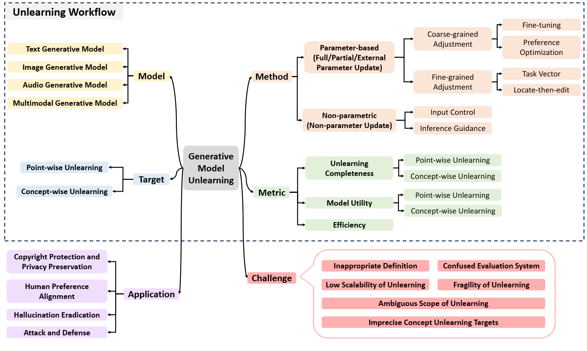

# Generative-model-unlearning-survey
[](https://arxiv.org/abs/2507.19894)
[](https://github.com/caxLee/Generative-model-unlearning-survey)


A collection of papers and resources about  Generative Model Unlearning (**GenMU**).

With the rapid advancement of generative models, associated privacy concerns have attracted growing attention. To address this,
researchers have begun adapting machine unlearning techniques from traditional classification models to generative settings. Although
notable progress has been made in this area, a unified framework for systematically organizing and integrating existing work is still
lacking. The substantial differences among current studies in terms of unlearning objectives and evaluation protocols hinder the
objective and fair comparison of various approaches. While some studies focus on specific types of generative models, they often
overlook the commonalities and systematic characteristics inherent in Generative Model Unlearning (GenMU). To bridge this gap,
we provide a comprehensive review of current research on GenMU and propose a unified analytical framework for categorizing
unlearning objectives, methodological strategies, and evaluation metrics. In addition, we explore the connections between GenMU and
related techniques, including model editing, reinforcement learning from human feedback, and controllable generation. We further
highlight the potential practical value of unlearning techniques in real-world applications. Finally, we identify key challenges and
outline future research directions aimed at laying a solid foundation for further advancements in this field.

<p align="center">

</p>

## News
🤗 We're actively working on this project, and your interest is greatly appreciated! To keep up with the latest developments, please consider hit the **STAR** 🌟 and **WATCH** for updates.
* Our survey paper: [A Survey on Generative Model Unlearning: Fundamentals, Taxonomy, Evaluation, and Future Direction]((https://arxiv.org/abs/2507.19894) is public.

## Overview


We hope this repository proves valuable to your research or practice in the field of self-supervised learning for recommendation systems. If you find it helpful, please consider citing our work:
```bibtex
@misc{feng2025surveygenerativemodelunlearning,
      title={A Survey on Generative Model Unlearning: Fundamentals, Taxonomy, Evaluation, and Future Direction}, 
      author={Xiaohua Feng and Jiaming Zhang and Fengyuan Yu and Chengye Wang and Li Zhang and Kaixiang Li and Yuyuan Li and Chaochao Chen and Jianwei Yin},
      year={2025},
      eprint={2507.19894},
      archivePrefix={arXiv},
      primaryClass={cs.LG},
      url={https://arxiv.org/abs/2507.19894}, 
}
```

## Table of Contents
- [Generative-model-unlearning-survey](#generative-model-unlearning-survey)
  - [News](#news)
  - [Overview](#overview)
  - [Table of Contents](#table-of-contents)
 

## Related 

## 🌐 Point-wise Unlearning
### Text
- (ACL'2023) Contrastive Learning for Recommender System [[paper](https://arxiv.org/abs/2101.01317)]
- (CIKM'2021) SimpleX: A Simple and Strong Baseline for Collaborative Filtering [[paper](https://dl.acm.org/doi/abs/10.1145/3459637.3482297)]
- (SIGIR'2021) Enhanced Graph Learning for Collaborative Filtering via Mutual Information Maximization [[paper](https://dl.acm.org/doi/abs/10.1145/3404835.3462928)]
- (SIGIR'2021) Self-supervised Graph Learning for Recommendation [[paper](https://dl.acm.org/doi/abs/10.1145/3404835.3462862)]
- (WSDM'2021) Bipartite Graph Embedding via Mutual Information Maximization [[paper](https://dl.acm.org/doi/abs/10.1145/3437963.3441783)]
- (DASFAA'2021) Diffusion-Based Graph Contrastive Learning for Recommendation with Implicit Feedback [[paper](https://link.springer.com/chapter/10.1007/978-3-031-00126-0_15)]
- (KDD'2022) Towards Representation Alignment and Uniformity in Collaborative Filtering [[paper](https://dl.acm.org/doi/abs/10.1145/3534678.3539253)]
- (KDD'2022) Self-Supervised Hypergraph Transformer for Recommender Systems [[paper](https://dl.acm.org/doi/abs/10.1145/3534678.3539473)]
### Image

### Audio

### Multimodal


## 🌐 Concept-wise Unlearning
### Text

### Image

### Audio

### Multimodal


## Contributing
If you have come across relevant resources, feel free to submit a pull request.
```
- (Journal/Confernce'20XX) **paper_name** [[paper](link)]
```


## Acknowledgements
The design of our README.md is inspired by [Awesome-SSLRec-Papers](https://github.com/HKUDS/Awesome-SSLRec-Papers), thanks to their works!
